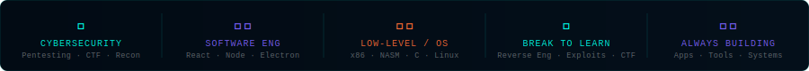

<div align="center">

<!-- BANNER -->


<br/>

<!-- TYPING ANIMATION via readme-typing-svg -->
[](https://git.io/typing-svg)

</div>

---

<div align="center">

```
╔══════════════════════════════════════════════════════════╗
║  ACCESS GRANTED  ·  WELCOME TO THE FORGE  ·  ROOT@CIPHER║
╚══════════════════════════════════════════════════════════╝
```

</div>

---

## `whoami`

```bash
$ cat /etc/profile.d/CipherForge.sh
```

```
Name        : Madushan Chandula
Role        : Software Engineering Undergraduate
University  : University of Kelaniya
Focus Areas : Cybersecurity · Systems Programming · Full-Stack Dev
Status      : [ ▰▰▰▰▱▱▱▱▱▱ ] Always learning. Never stopping.
Quote       : "I don't just use the system. I understand it."
```

I'm a Software Engineering student with a deep obsession for **how things break** — and how to build things that don't. My world lives at the intersection of **security research**, **low-level systems**, and **building real software** that solves real problems.

When I'm not writing code, I'm reverse engineering it. When I'm not defending systems, I'm finding ways past them — ethically, of course.

---

## `cat interests.txt`

<div align="center">

</div>

<br/>

| Domain | What I do |
|---|---|
| 🔐 **Cybersecurity** | Penetration testing concepts, CTF challenges, network recon, vulnerability research |
| ⚙️ **Software Engineering** | Full-stack development, desktop apps, system design, UML & architecture |
| 🖥️ **Low-Level / OS** | Bare-metal x86, bootloaders, GDT/IDT, scheduling — I like getting close to the metal |
| 💀 **Breaking Things** | Reverse engineering, exploit concepts, understanding how attacks actually work |
| 🛠️ **Building Things** | Electron + React apps, REST APIs, billing systems, tooling — shipping real products |

---

## `ls -la tech-stack/`

**Languages**


**Frontend / UI**


**Backend / Systems**


**Security & Tools**


---

## `./projects --highlight`

> Things I've built, broken, or both.

```
[01]  CipherForge          ──  This space. Security tools & experiments.
in Progress
```

---

## `tail -f /var/log/current-mission.log`

```
[INFO]  Currently diving into: x86 bare-metal OS development
[INFO]  Exploring:             Cybersecurity fundamentals & CTF techniques  
[INFO]  Building:              Security-focused tools & experiments
[INFO]  Learning:              Exploit development · Network security · Reverse Eng
[WARN]  Sleep schedule:        undefined
[OK]    Coffee level:          ▰▰▰▰▰▰▰▰▰▱ 90%
```

---

## `uptime --philosophy`

<div align="center">

```
┌─────────────────────────────────────────────────────────┐
│                                                         │
│   The best way to understand a system is to break it.   │
│   The best way to secure a system is to think like      │
│   the person who wants to break it.                     │
│                                                         │
│                               — me, at 2am, probably    │
└─────────────────────────────────────────────────────────┘
```

</div>

---

## `ping me --connect`

<div align="center">

[](https://github.com/Chandula2324)
[](https://linkedin.com/in/chandula-j-p-d-m-27421b374/)
[](mailto:your@email.com)

</div>

---

## `git log --stats`

<div align="center">


</div>

---

<div align="center">

```
> session_end --logout
[ OK ] Thanks for visiting. Go break something (legally).
[ OK ] Connection closed.
```


</div>
